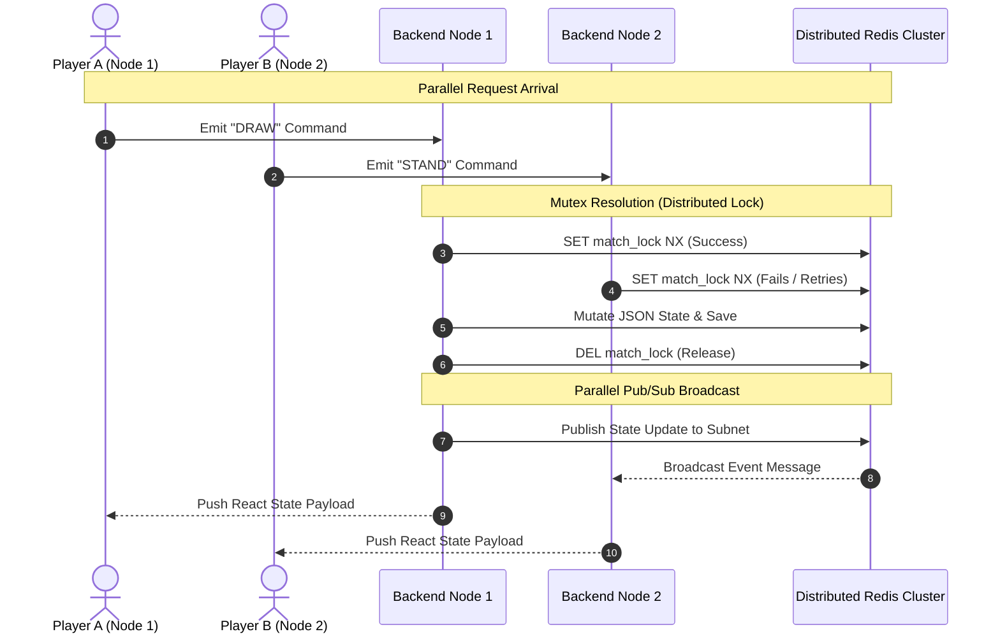

# Parallel & Distributed Computing (PDC) Background

> **Academic Context**: This documentation serves as the background and architectural reference for our **Parallel and Distributed Computing** course submission. It demonstrates how modern real-time multiplayer applications resolve high-concurrency race conditions, distributed state synchronization, and non-blocking parallel workloads across cluster computing environments.

---

## 🏛️ Project Background & Motivation

In real-time multiplayer card games like **Card Clash 21**, players interact with the game state simultaneously from distributed client endpoints. In a simple single-threaded, centralized application, managing player turns is straightforward. However, when deployed to a modern cloud infrastructure utilizing multiple backend server nodes and load balancers, critical computer science challenges emerge:

1. **The Double-Draw Race Condition**: Two players (or a player and an automated AI bot loop) submitting actions at the exact same millisecond can trigger conflicting state updates if operations overlap.
2. **Distributed Queue Contention**: Hundreds of anonymous players querying and attempting to pop the same matchmaking slot simultaneously leads to split-brain assignments unless synchronized atomically.
3. **Non-Blocking Cluster Synchronization**: Real-time broadcasts must propagate across isolated server containers instantly without introducing thread-blocking network lag.

To solve these issues, our architecture heavily implements core **Concurrency Control** mechanisms, **Distributed Memory Locks**, and **Asynchronous Event Parallelism**.

---

## ⚡ Concurrency & Parallelism Implementations

### 1. Distributed Locking (Mutex Synchronization)
When a match is in progress, multiple concurrent inputs (such as a player rapidly clicking "+ DRAW" while the backend interval loop processes a timed-out bot action) arrive asynchronously. 

To prevent concurrent thread execution from corrupting the round deck array or player turn tracking, we implement **Distributed Mutex Locks** via Redis:

```typescript
// Concurrency Guard: Ensure events for the same match process in strict sequence per cluster node
const lockAcquired = await acquireMatchLock(matchId, 2000);
if (!lockAcquired) {
  socket.emit("match:error", { message: "Action stream highly active. Concurrency limit protected." });
  return;
}
```
- **Mechanism**: The backend utilizes atomic Redis `SET key value NX PX timeout` commands. The `NX` (Not Exists) flag guarantees that only a single processing thread across the entire distributed server cluster can acquire exclusive mutation rights to a specific `MatchState` at any given instant.
- **Outcome**: Overlapping concurrent network packets are queued or rejected safely, completely eliminating out-of-order game logic execution.

---

### 2. Optimistic Concurrency Control (OCC) via Atomic Transactions
During matchmaking, multiple server instances query the global list of waiting sessions simultaneously to inject new human players or autonomous AI duelists. Traditional pessimistic locking would degrade queue ingestion throughput.

Instead, we apply **Optimistic Concurrency Control (OCC)** using Redis Transaction streams (`WATCH`, `MULTI`, `EXEC`):

```typescript
await redis.watch(key);
const record = await getMatch(matchId);

// Verify state condition still holds
if (!record || record.match.status !== "WAITING") {
  await redis.unwatch();
  return null;
}

// Prepare atomic transaction block
const multi = redis.multi();
await saveRecord(record, multi);
const results = await multi.exec();

if (results === null) {
  // Concurrency collision detected: another node modified the record first. Safe retry loop.
  continue; 
}
```
- **Mechanism**: By executing `WATCH` on a match key, the database tracks data modifications. If a parallel backend node successfully pairs a player into that exact match slot before our transaction executes, `EXEC` returns `null` automatically, rolling back safely without leaving dirty or orphan states.

---

### 3. Asynchronous Event-Driven Parallelism
To ensure maximum server responsiveness and horizontal scaling capabilities, our system leverages non-blocking parallel workloads:

- **Parallel Heuristic Engine**: Automated bot moves and stale matchmaking injections are evaluated continuously across parallel asynchronous background tasks (`setInterval` timers) without consuming or locking the primary Express HTTP request handling thread.
- **Pub/Sub Cluster Scaling**: Through the **Socket.IO Redis Adapter**, instances running independently in different regions or container nodes publish state updates over highly parallelized Redis messaging channels. This allows cross-server clients to subscribe and sync their React components simultaneously with near-zero latency overhead.

---

## 📊 Architectural Flow Summary



## 🎓 Summary of Subject Competencies Achieved
By bridging distributed database operations with event loop parallelism, this project actively applies core **Parallel and Distributed Computing** principles:
- **Atomicity & Isolation** in high-throughput database interactions.
- **Deadlock prevention** via fixed lock expiry timeouts.
- **Horizontal scaling resiliency** across independent edge nodes.

---

## ⚡ Real-Time Systems Evolution: The Low-Latency Architecture Shift

To achieve sub-50ms real-time responsiveness targets while maintaining complete concurrency safety across horizontally scaled clusters, the platform was systematically upgraded from pessimistic global locks to an **event-driven, localized action queue model**:

### 🧠 Core Architectural Paradigm Shift
* **From Lock-Based Synchronization** ➡️ **To Local Action Queues**: Distributed mutex primitives (`acquireMatchLock`) were entirely stripped from the game action loops. The system now uses deterministic in-memory FIFO buffers (`matchQueues`) to sequentially evaluate player command payloads per match.
* **From Heavy Multi-Node Traversal** ➡️ **To Sharded Task Ring**: Localized event listeners assign matches directly to client socket owners, preventing unneeded distributed locks across Redis infrastructure.
* **From Full Snapshot Serialization** ➡️ **To Delta Diffs**: The event emitter publishes granular patch properties (`match:patch`) over low-latency multi-channel routes (`io.local`), instantly updating UI components without deep network transmission blockages.
* **From OCC Transaction Loops** ➡️ **To Atomic Lua Execution**: Optimistic checks during join attempts have been hardened into native C-engine Redis Lua packages (`atomicJoinMatch`), executing atomic evaluation and storage within a single pipeline cycle.
* **From Event Loop Blocking** ➡️ **To Native Worker Threads**: Autonomous AI decision arrays are decoupled onto persistent background singletons (`botWorker.ts`), computing high-depth heuristic branches asynchronously.

